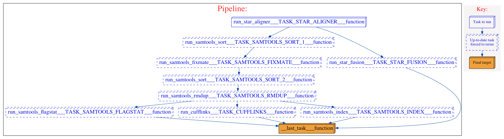

========================
star_cufflinks workflow 
========================
.. topic:: Development information

    * Date Created : Aug. 14, 2015
    * Last Update  : Sep. 3, 2015
    * Developer    : Jafar Taghiyar (jtaghiyar@bccrc.ca)

This workflow:

* runs `STAR <https://github.com/alexdobin/STAR>`_ aligner on a list of paired fastq files 
* runs `STAR-Fusion <https://github.com/STAR-Fusion/STAR-Fusion>`_ on the results from STAR
* runs `Samtools <http://samtools.sourceforge.net/>`_ to sort, fixmate, index and remove duplicates from the resulting bam files
* runs `Cufflinks <https://github.com/cole-trapnell-lab/cufflinks>`_ on the final bam files

.. here you can add the workflow plot

    
Components
==========
* *component 1*: 

 * component_name: `run_star_aligner <https://github.com/MO-BCCRC/run_star_aligner>`_
 * component_version: '1.0.0'
 * seed_version: '2.4.2a'

* *component 2*:

 * component_name: `run_star_fusion <https://github.com/MO-BCCRC/run_star_fusion>`_
 * component_version: '1.0.0'
 * seed_version: '0.4.0'

* *component 3*:
        
 * component_name: `run_samtools_sort <https://github.com/MO-BCCRC/run_samtools_sort>`_
 * component_version: '1.0.0'
 * seed_version: '0.1.19'

* *component 4*:
        
 * component_name: `run_samtools_fixmate <https://github.com/MO-BCCRC/run_samtools_fixmate>`_
 * component_version: '1.0.0'
 * seed_version: '0.1.19'

* *component 5*:
        
 * component_name: `run_samtools_rmdup <https://github.com/MO-BCCRC/run_samtools_rmdup>`_
 * component_version: '1.0.0'
 * seed_version: '0.1.19'   

* *component 6*:     

 * component_name: `run_samtools_index <https://github.com/MO-BCCRC/run_samtools_index>`_
 * component_version: '1.0.0'
 * seed_version: '0.1.19'

* *component 7*:

 * component_name: `run_samtools_flagstat <https://github.com/MO-BCCRC/run_samtools_flagstat>`_
 * component_version: '1.0.0'
 * seed_version: '0.1.19'

* *component 8*:        
 
 * component_name: `run_cufflinks <https://github.com/MO-BCCRC/run_cufflinks>`_
 * component_version: '1.0.0'
 * seed_version: '2.1.1'

Requirements
============
* `Kronos <https://pypi.python.org/pypi/kronos-pipeliner/2.0.4>`_  >=v2.0.4
* Python >= v2.7.6
* STAR == 2.4.2a
* STAR-Fusion == 0.4.0
* Samtools == 0.1.18
* Cufflinks == 2.1.1

How to run the workflow
=======================    
**Step 1.** Update the ``setup.txt`` file provided with the workflow by passing proper paths/values to the *value* column.

.. note::

    The above file is a tab separated file and the first line, *i.e.* '``#section key value``', is part of the file.
    
**Step 2.** Update the ``input.txt`` file with proper paths/values.

.. note::

    The above file is a tab separated file and the first line, *i.e.* '``#sample_id ...``', is part of the file.
    Sample ID's are arbitrary.
    However, they cannot be used more than once in an input file.
      
**Step 3.** Run the workflow using the following command:

.. code:: bash
 
     kronos run -c <path/to/components_dir/ -e <a name for workflow> 
                -i <input.txt> -r <run_id> -s <setup.txt>  
                -w <workind_dir> -y <path/to/config.yaml>

Please note to replace ``<.>`` with the actual values.
See kronos online documentation for more information on the `run <http://kronos.readthedocs.org/en/latest/launch_pipeline/run.html#how-to-run-pipeline>`_ command.

Outputs
=======
The resulting files will be saved in the <working_dir>/<run_id> directory.
For this workflow, the final result files are:

* *star_fusion* directory where the STAR-Fusion results are stored
* in *results* directory:
 
 * Samtools flagstat file
 * sorted, removed-duplicate bam file
 * the index of the bam file, *i.e.* *bai* file
 * *cufflinks* directory where the Cufflinks results are stored

  
Please refer to the Kronos online documentation for more information on the structure of the `results directory <http://kronos.readthedocs.org/en/latest/launch_pipeline/run.html#results-generated-by-a-pipeline>`_.

Changelog
=========
* v1.0: first release.
